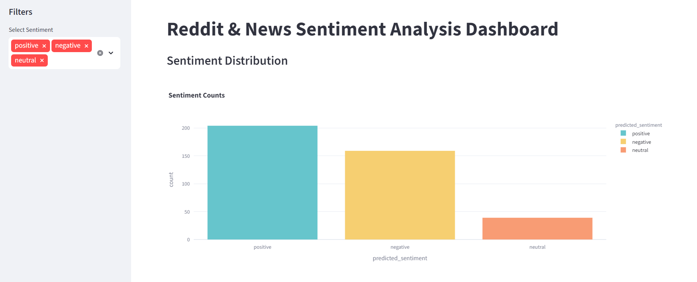

# reddit-news-sentiment-analysis
## Project Overview
This project builds an end-to-end NLP pipeline to analyze sentiment in Reddit posts and news headlines.
The pipeline collects data, cleans text, generates embeddings, trains a classifier, and visualizes sentiment trends in an interactive dashboard.

## Features
- Scrapes Reddit posts and news headlines
- Cleans and preprocesses text
- Generates embeddings using sentence-transformers
- Trains a sentiment classifier
- Saves sentiment predictions
- Visualizes results with a Streamlit dashboard

## Example Output
The dashboard shows sentiment distribution and example headlines with predicted sentiment labels.

## How to Run the Project
1. Clone the repository
git clone https://github.com/Pakiza07/reddit-news-sentiment-analysis.git
cd reddit-news-sentiment-analysis

2. Install dependencies
pip install -r requirements.txt

3. Run the prediction pipeline
python src/predict.py

4. Launch the dashboard
streamlit run src/dashboard.py

## Project Structure
reddit-news-sentiment-analysis/
│
├── data/
│ ├── raw/ # raw scraped data
│ └── cleaned/ # cleaned datasets used for modeling
│
├── src/
│ ├── scraper.py # collects Reddit/news data
│ ├── prep_data.py # cleans and preprocesses text
│ ├── train_model.py # trains sentiment model
│ ├── predict.py # generates sentiment predictions
│ ├── dashboard.py # Streamlit dashboard
│ └── utils.py # helper functions
│
├── outputs/
│ ├── sentiment_results.csv # final predictions
│ ├── sentiment_model_embeddings.pkl # trained classifier
│ └── embedder.pkl # embedding model
│
├── notebooks/ # experiments and analysis
├── requirements.txt # project dependencies
├── .gitignore # ignored files
├── LICENSE # license file
└── README.md # project documentation

## Model Explanation

The sentiment classifier uses **sentence embeddings** generated from a pretrained model.  
A **Logistic Regression** classifier predicts sentiment labels based on these embeddings.  
TF-IDF features were also tested for comparison.  
The pipeline saves predictions and visualizes sentiment trends in the Streamlit dashboard.

## Dashboard Preview

